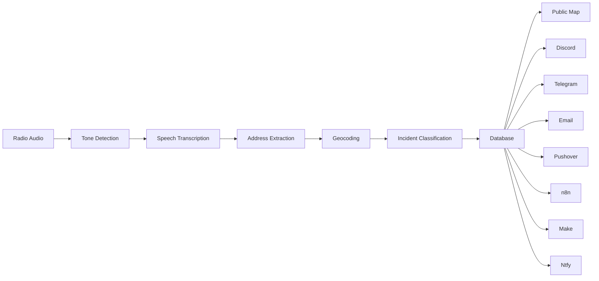

# iCAD Dispatch v2
{: .fs-9 }

Real-time Emergency Services Dispatch System for Fire, EMS, and Public Safety agencies across North America.
{: .fs-6 .fw-300 }

[Get Started](quickstart){: .btn .btn-primary .fs-5 .mb-4 .mb-md-0 .mr-2 }
[View on GitHub](https://github.com/YOUR_GITHUB_USERNAME/icad_dispatch_v2){: .btn .fs-5 .mb-4 .mb-md-0 }

---

## What is iCAD Dispatch?

iCAD Dispatch v2 is a **real-time radio call processing and notification system** designed for emergency services dispatch centers, fire departments, and EMS agencies.

It automatically:
- **Detects tones** from radio transmissions (two-tone paging, long-tone, MDC, DTMF)
- **Transcribes speech** using OpenAI Whisper
- **Extracts addresses** from transcripts using AI + geocoding
- **Classifies incidents** (Fire, Medical, Traffic, Rescue, HazMat, etc.)
- **Sends alerts** to Discord, Telegram, Email, Pushover, n8n, Make, and Ntfy
- **Displays calls** on a live public map with real-time WebSocket updates

---

## Who is it for?

iCAD Dispatch is built for **North American emergency services**:

- **Fire Departments** — monitor tone-outs, track incident locations
- **EMS Agencies** — dispatch medical calls with address extraction
- **Dispatch Centers** — consolidate multi-agency call tracking
- **Public Information Officers** — share real-time incident maps with the public
- **Volunteer Stations** — receive instant notifications when your tones fire

---

## How it works



1. **Radio audio** is uploaded to iCAD via the call upload endpoint
2. **Tone detection** identifies which station/agency was paged
3. **Transcription** converts the audio to searchable text
4. **Address extraction** pulls location information from the transcript
5. **Geocoding** converts the address to lat/lng coordinates
6. **Incident classification** categorizes the call type
7. **Notifications** fire to all configured channels simultaneously
8. **Public map** updates in real-time for public viewing

---

## Key Features

| Feature | Description |
|---------|-------------|
| **AI Transcription** | OpenAI Whisper local or API-based |
| **Address Extraction** | LLM-powered parsing with Nominatim + Google Maps |
| **Multi-Channel Alerts** | 7 notification channels supported |
| **Live Public Map** | Real-time WebSocket updates with dark mode |
| **Map Corrections** | Drag-and-drop location fixes via dashboard |
| **Call History** | PostgreSQL database with configurable retention |
| **Security** | Rate limiting, CSRF, path traversal prevention |
| **Containerized** | Docker Compose deployment, easy updates |

---

## Getting Started

### Option 1: One-Click Installer (Recommended)

```bash
curl -fsSL https://raw.githubusercontent.com/YOUR_GITHUB_USERNAME/icad_dispatch_v2/main/install.sh | bash
```

### Option 2: Manual Docker Setup

```bash
git clone https://github.com/YOUR_GITHUB_USERNAME/icad_dispatch_v2.git
cd icad_dispatch_v2
cp .env.example .env
# Edit .env with your domain and secrets
docker compose -f docker-compose.production.yml up -d
```

### Option 3: Manual Native Install

See [Native Installation Guide](installation/native.md) for Python + PostgreSQL setup.

---

## Documentation Index

- **[Quick Start](quickstart.md)** — 15-minute Docker setup
- **[Architecture](architecture.md)** — System design and data flow
- **[Installation](installation/)** — Docker, native, and one-click methods
- **[Configuration](configuration/)** — Environment variables, geocoding, notifiers
- **[Security](security.md)** — Hardening checklist and best practices
- **[API Reference](api.md)** — REST API endpoints
- **[Troubleshooting](troubleshooting.md)** — Common issues and solutions

---

## Requirements

| Component | Minimum | Recommended |
|-----------|---------|-------------|
| OS | Ubuntu 22.04 / Debian 12 | Ubuntu 24.04 LTS |
| CPU | 2 cores | 4+ cores |
| RAM | 4 GB | 8 GB |
| Disk | 20 GB SSD | 50 GB SSD |
| Docker | 24.0+ | Latest |
| Docker Compose | 2.0+ | Latest |

---

## License

[MIT License](https://github.com/YOUR_GITHUB_USERNAME/icad_dispatch_v2/blob/main/LICENSE) — free for personal and commercial use.

---

*Built with ❤️ for first responders everywhere.*
